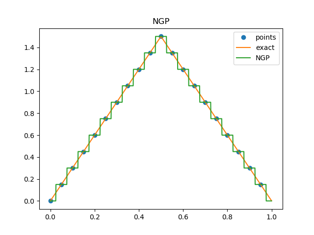

Example: Interpolation on 1-dimension
=====================================

This example tests the basic interface of the 
grid class and the filters defined in libpm.
Particularly the interpolation routines.
A function *F* in 1-dimension in the interval [0,1]
is sampled by a grid of size *N*, then 
*M* points are requested from the grid
interpolator, with *M>N*.

Triangular shape
----------------

In this case *F=3 min(x,1-x)* which is a triangular
shape, and *N=20*.

Nearest grid point (ngp) function compared to 
the exact interpolation filter (Whittaker-Shannon formula)

Cloud-in-cell (cic) function compared to 
the exact interpolation filter (Whittaker-Shannon formula)

Triangular-shaped-cloud (tsc) function compared to 
the exact interpolation filter (Whittaker-Shannon formula)

Piecewise-cubic-spline (pcs) function compared to 
the exact interpolation filter (Whittaker-Shannon formula)

Gaussian function compared to 
the exact interpolation filter (Whittaker-Shannon formula)

Sine+sine
---------

In this case *F= sin(2 pi x)+3 sin(4 pi x)* and *N=20*.

Nearest grid point (ngp) function compared to 
the exact interpolation filter (Whittaker-Shannon formula)

Cloud-in-cell (cic) function compared to 
the exact interpolation filter (Whittaker-Shannon formula)

Triangular-shaped-cloud (tsc) function compared to 
the exact interpolation filter (Whittaker-Shannon formula)

Piecewise-cubic-spline (pcs) function compared to 
the exact interpolation filter (Whittaker-Shannon formula)

Gaussian function compared to 
the exact interpolation filter (Whittaker-Shannon formula)

