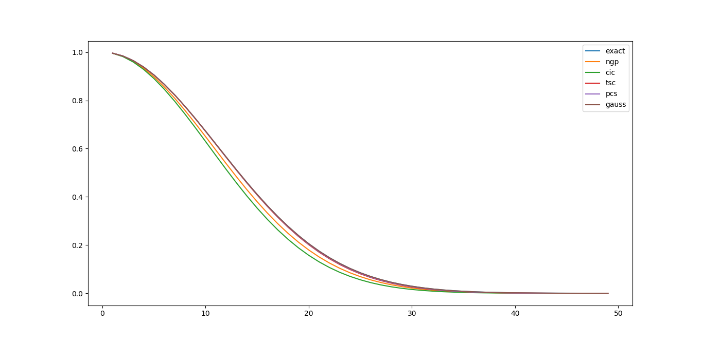

Example: Power spectrum on 1-dimension
=====================================

This example tests the basic interface of the 
grid class and the filters defined in libpm.
Particularly the sampling routines.
*M* particles are placed in in 1-dimension in the interval [0,1]
with positions normally distributed with variance *sigma*.
A grid of size *N* is then used to sample
those points and the power spectrum is computed.

With *M=100'000* particles and a grid 
size *N=100*, the different sampling filters:
- Nearest-grid-point (NGP),
- Cloud-in-cell (CIC),
- Triangular-shaped-cloud (TSC),
- Piecewise-cubic-split (PCS),
- Gaussian,
- Low-pass with *k_max = 10*,
are tested against an exact grid filter (Nyquist-Shannon kernel *k_max=50*).

Case with *sigma=0.05*, all sampling filters give similar
power spectrum.

Case with *sigma=0.01*, differences start to show in the highest modes.
The Low-pass filter with *k_max=10* decays abruptly at *k=11* as expected.

Case with *sigma=0.005*. 
The Low-pass filter with *k_max=10* decays abruptly at *k=11* as expected.
The NGP filter goes above the exact grid filter indicating aliasing.

