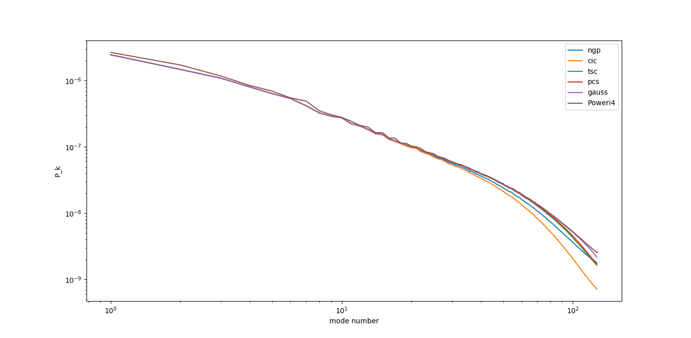

Example: Power spectrum on 3-dimensions
=======================================

This example tests the basic interface of the 
grid class and the filters defined in libpm.
Particularly the sampling routines, computation of the FFT
and computation of the amplitude of the Fourier modes.
The input consists of a snapshot from a cosmological simmulation 
*z=0* with *M=256^3* in 3-dimensions.
A grid of size *N=256* is then used to compute the power spectrum.
The power spectrum obtained with the libpm
using the filters:
- Nearest-grid-point (NGP),
- Cloud-in-cell (CIC),
- Triangular-shaped-cloud (TSC),
- Piecewise-cubic-split (PCS),
- Gaussian,
is then compared with the power spectrum obtained
using Sefusatti's code "Poweri4".

